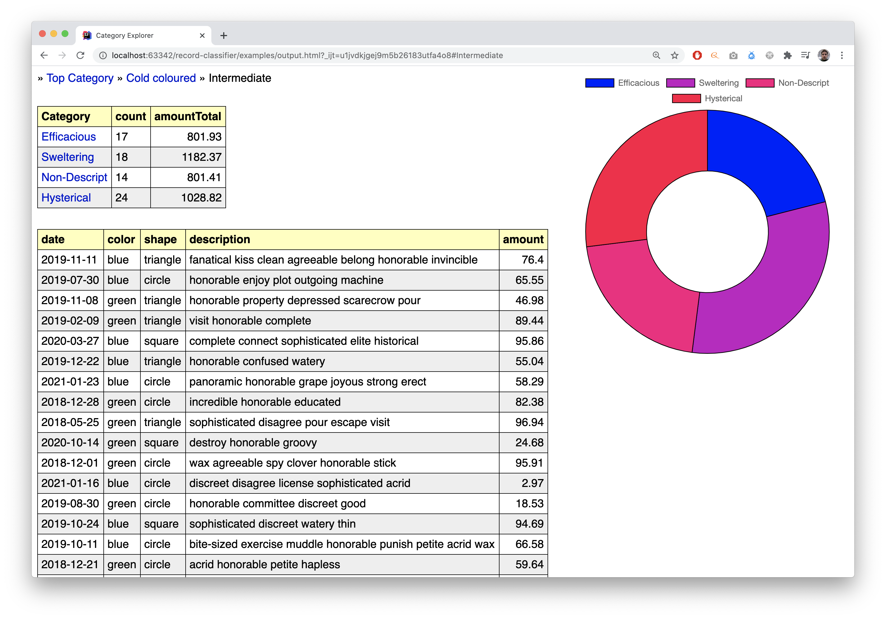

# record-classifier

A program that allows you to classify arbitrary data
("records") into a tree structure of categories
and calculate certain aggregations on them.

## Description

The program takes as input a configuration YAML file. This file
defines:

- the data source (csv file, etc.)
- the data fields of each record
- the category tree definition
- the aggregations to be calculated
- the output format (json, html, etc)

Every category is assigned a "condition" which is a boolean
expression that determines whether a certain record matches
that specific category.

Currently, the program supports reading records from a local
CSV file, and produces as output either a JSON file or an
HTML file containing the output data and a simple UI
("Category Explorer") that allows the use to "navigate" throughout
the category tree.

## Usage

To run the program simply execute the JAR file with one
single command line parameter pointing to the configuration
YAML file. Any further customizations are defined within
the configuration file itself. E.g.:

```
# java -jar record-classifier.jar configuration.yml
```

## Conditions DSL

Every category has a condition which is a boolean expression in a
simple domain specific language, for example:

```
someField == 'some value' && ! someOtherField contains 'something'
```

### String operators

Equality

```
someField = 'some value'
```

```
someField equalsIgnoreCase 'sOmE vAluE'
```

Substring matching

```
someField startsWith 'abc'
```

```
someField endsWith 'xyz'
```

```
someField contains 'klm'
```

### Boolean operators

Logical conjuction

```
someField == 'abc' && someOtherField == 'xyz'
```

Logical disjunction

```
someField == 'abc' || someOtherField == 'xyz'
```

Logical negation

```
! someField == 'abc'
```

### Operator precedence

Expressions are by default evaluated from left to right. To change
the order of evaluation parentheses can be used.

```
someField == 'abc' && (someOtherField == 'klm' || someOtherField == 'xyz')
```

### Boolean constants

```
true
```

```
false
```

## Examples

In the examples directory you can find some examples with
dummy data and configuration.

This is a screenshot of what the generated UI can look like:



## Contact

If you have any question or need help please email me at:
giannis.tsakiris [at] gmail.com
